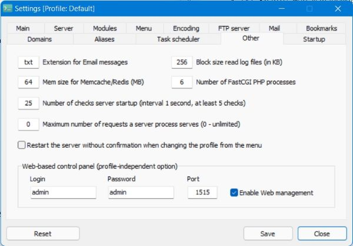

# Command line tool

It is a command line tool to provide a control over Open Server.

## Usage

```
USAGE
  ospctl [-v] [-d DIR] CMD

OPTIONS
  DIR is the directory to specify another location for Open Server.

  CMD is one of the commands explained below.

  These commands are used to control the Open Server main process:
    run         Launch the Open Server
    kill        Terminate the Open Server
    force-kill  Terminate the Open Server forcefully

  These commands are used to control servers:
    start       Start servers
    stop        Stop servers
    restart     Restart servers

  Other commands
    status      Show status for all processes

ENVIRONMENT
  OSP_HOME
  If specified and valid, it's used as the Open Server home directory.
  It can be overwritten with the "-d" option in the command line.
```

## Requirements

* `taskkill` (shipped with Windows) to terminate the main process
* `powershell` or `wmic` (shipped with Windows; the first found is used) to display the status
* `wget` (shipped with Open Server) to start, stop and restart servers

The commands `start`, `stop` and `restart` require __Web management__ enabled in Settings:


